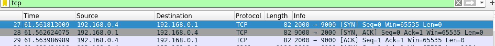
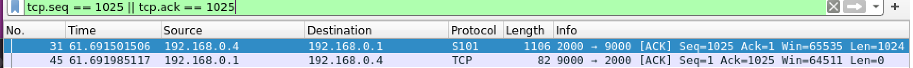
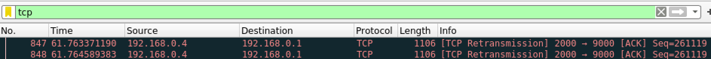
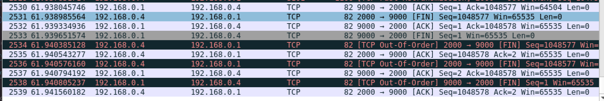

# IP
## How we abstract different layers:
* Link layer:
Our link layer only handles sending and receiving of udp packets to real IP addresses (in our case localhost:port)
* Network Layer / Forwarding logic:
Our network layer is where all the forwarding magic 🪄 happens. To be more specific, it figures out the next hop given a destination IP address and forwards data to the appropriate node by translating VIP to real IP. Also calls the appropriate handler when we are the destination for a packet.
* Application Layer:
The applications can register their handlers and protocol numbers with the network layer. When the network layer receives a packet for our node, it will call the appropriate handler and pass the data to the application.
## How our thread model for our RIP implementation works:
The RIP handler modifies the forwarding table entries - it access the network layer data through a parameter passed into its Init function

There a few goroutines involved to make RIP work
* The RIP Handler is invoked via HandlePacket in the network layer. Handle packet is run as a separate goroutine (whenever a new packet is received)
* Another goroutine runs that periodically sends the forwarding table out to all the neighboring nodes (every 5 seconds)
* Finally, there is a goroutine for periodically deleting stale (>12 seconds old) entries from the table (every 2 seconds)

## How we process IP packets:
1. We receive a UDP packet on our port, and we send it to the network layer.
2. The network layer verifies the checksum for the packet.
3. It then determines who the final destination for the packet is
    * If we are the destination, it will forward the packet to the appropriate application handler
    * Else it figures out the next hop for the final destination (dropping packets that we don't know how to forward), decrements the TTL, recalculates the Checksum and sends the packet to the next hop using the link layer.

## Tools we used:
We built the code locally and in the course Docker container
We did not use wireshark for the project, instead we trusted our guts
(We realize that using Wireshark may have made our lives easier and we will try to use it for TCP)

To build the project run `make` in the course docker container.

# TCP
## Captures
The following are the captures of sending a one MB file from node C (port 2000) to node A (port 2000) with node B in between that has a lossy rate of 2%.
* 3-way handshake

* One example segment sent and acknowledged

* One segment that is retransmitted

* Connection teardown: frame 2531, 2532, 2533, 2535, 2537 and 2539

## Performance
The times are measured when sending a 2MB file from node C to node A that has a lossy node B in between:
* reference nodes: 0.8 seconds
* our nodes: 1 second

## Files
* [types.go](pkg/applications/tcp/types.go): Definitions of structs, variables and consts
* [tcp.go](pkg/applications/tcp/tcp.go): contains init and other api's that main.go uses
* [connect.go](pkg/applications/tcp/connect.go): connect function
* [listener.go](pkg/applications/tcp/listener.go): accept and listen functions
* [socket.go](pkg/applications/tcp/socket.go): main logic for handling an incoming packet and writing a packet to the other end
* [read.go](pkg/applications/tcp/read.go): read from the circular buffer
* [write.go](pkg/applications/tcp/write.go): write to the circular buffer
* [shutdown.go](pkg/applications/tcp/shutdown.go): shutdown logic
* [close.go](pkg/applications/tcp/close.go): close logic
* [heap.go](pkg/applications/tcp/heap.go): contain heap struct used as the early arrival queue
* [common.go](pkg/applications/tcp/common.go): util functions used across files in the tcp package

## Known bug:
* Teardown doesn't work with the reference node once in a while